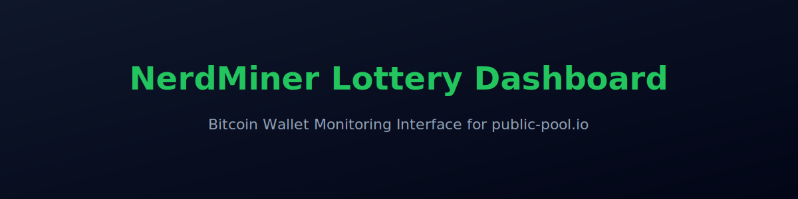

<p align="center">
  
</p>

<p align="center">
  A clean, client-side Bitcoin mining dashboard for monitoring wallet statistics on public-pool.io.
</p>

<p align="center">
  
  
  
  
  
</p>

---

## 📌 Overview

NerdMiner Lottery Dashboard is a lightweight, front-end web application designed to monitor Bitcoin mining statistics for a public-pool.io wallet address. The dashboard displays worker hashrate, network data, stability metrics, and live hash history — all in real-time without requiring a backend server.

This project is ideal for hobby miners, self-hosted setups, or any solo mining dashboard user.

---

## 🚀 Features

### Mining Metrics

- Total wallet hashrate
- Active worker count and activity status
- Best share difficulty achieved
- Average hash per active worker
- Stability score calculation

### Network Data

- Current Bitcoin block height
- Network difficulty (formatted and compact)
- Live Bitcoin price (via CoinGecko API)

### Visualization

- Dynamic hashrate chart powered by Chart.js
- Auto-refresh data updates
- CSV export of milestone statistics

### Interface

- Responsive layout with modern dark theme
- TailwindCSS styling
- Optional animated background effects
- Sidebar navigation for settings and export

---

## 📁 Quick Demo

Access the live dashboard deployed via GitHub Pages: https://death128.github.io/nerdminer-dashboard/

---

## 🛠️ Deployment

### GitHub Pages (Recommended)

1. Push this repository to GitHub.
2. Navigate to: **Settings → Pages**
3. Under **Source**, select:
   - Branch: `main`
   - Folder: `/ (root)`
4. Click **Save**.

The dashboard will be deployed at: https://YOURNAME.github.io/YOURREPONAME/

---

### Local Hosting

To serve the dashboard locally:

```bash
cd <your-dashboard-folder>
python3 -m http.server 8080
```
- Then open in a browser: http://localhost:8080
- Or from another device on your network: http://<YOUR_LOCAL_IP>:8080

---

## 📖 How It Works

- User enters a Bitcoin wallet address into the dashboard.
- The dashboard queries the public-pool.io API for wallet and worker data.
- Network metrics (difficulty, block height) are fetched.
- All rendering and calculations occur client-side using JavaScript.
- Data updates automatically at regular intervals.

- No server logic.
- No private keys.
- No database.
- No backend authentication required.

---

## 🔌 Adding NerdMiner Devices

The dashboard does not require manual device registration.
Any NerdMiner configured with the same Bitcoin wallet address will automatically appear once connected to the mining pool.

- Configure a NerdMiner
- Power on the NerdMiner.
- Connect to the device’s Wi-Fi access point.
- Open the configuration portal (typically http://192.168.4.1).
- Enter your Bitcoin wallet address.
- Save the configuration and allow the device to reboot.
- The wallet address configured on the NerdMiner must match the wallet entered into the dashboard.
- Confirm Pool Connection
- Ensure the NerdMiner is configured to mine on public-pool.io.

## Once connected:
- The device will register as a worker under your wallet.
- The mining pool will begin reporting worker statistics.
- The dashboard will automatically detect and display the device during the next refresh cycle.
- No additional setup inside the dashboard is required.
- Using Multiple Devices

## If multiple NerdMiner devices are configured with the same wallet:
- Each device appears as a separate worker.
- Total wallet hashrate is aggregated automatically.
- Stability reflects active vs total workers.
- Average hash per active worker is calculated client-side.
- All aggregation logic occurs within the browser.

## Troubleshooting
- If a device does not appear in the dashboard:
- Verify the wallet address is correct.
- Confirm the device is connected to Wi-Fi.
- Confirm it is successfully mining on public-pool.io.
- Allow several minutes for the pool to report the worker.
- You can also verify worker visibility directly on the mining pool by searching your wallet address.

## Important
- The dashboard does not communicate directly with NerdMiner hardware.
- It retrieves worker statistics from the mining pool API only.
- Any properly configured NerdMiner connected to the same wallet and pool will automatically be reflected in the dashboard.

---

## 🔐 Security

This project only uses public APIs for read-only mining statistics.
No sensitive information is requested or stored by the application.

---

## 💻 Tech Stack

HTML5 – Markup structure

TailwindCSS – Styling

Vanilla JavaScript – Application logic

Chart.js – Charts and data visualization

Canvas API – Background animations

---

## 📜 License

This project is licensed under the MIT License.
See the LICENSE file for details.

---

## 🧠 Notes

This dashboard is designed for monitoring and visualization purposes only.
Bitcoin solo mining is probabilistic and does not guarantee block rewards.

---

## 🎯 Contributing

Contributions, issues, and feature requests are welcome.

Fork the repository

Create a new branch

Submit a pull request

---

## 📞 Contact

Please open an issue on GitHub for questions or support.

https://github.com/Death128/nerdminer-dashboard/issues
